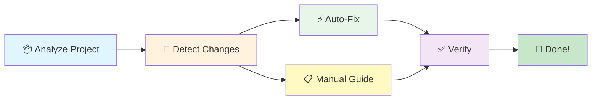
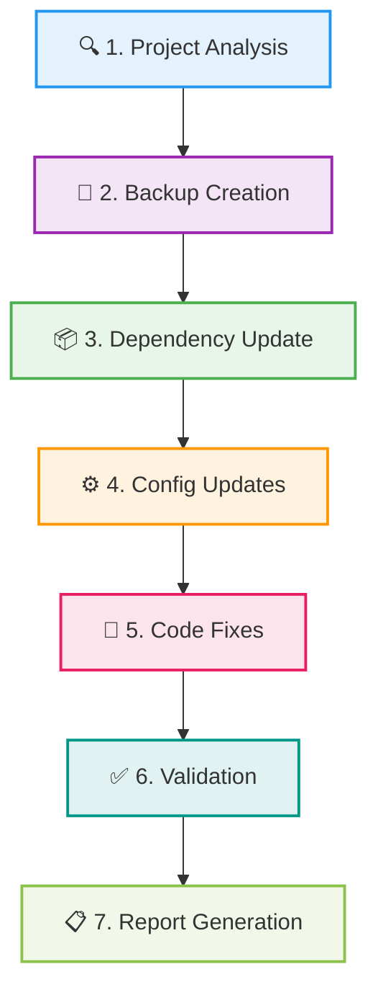

<div align="center">

# 🚀 Expo Upgrade Wizard

### ⚡ Streamline Your Expo SDK Upgrades in Minutes, Not Hours

[](https://opensource.org/licenses/MIT)
[](https://nodejs.org)
[](CONTRIBUTING.md)
[](https://github.com/vishwa-glitch/expo-upgrade-wizard)

<p align="center">
  
  
  
</p>

---

### 🎯 Reduce upgrade time from **several hours** to **1-3 hours** with intelligent automation

</div>

<br/>

<div align="center">

| ✨ **FREE & OPEN SOURCE** | 🛡️ **Enterprise-Ready** | 🔄 **Auto-Rollback** |
|:---:|:---:|:---:|
| MIT Licensed - Free forever | Built for scale | One-command restoration |

</div>

<br/>

> **📦 Current Version:** `1.0.0` | [📋 View Changelog](CHANGELOG.md)

---

## ✨ Features

<table>
<tr>
<td width="50%">

### 🎯 **Smart Automation**
- ⚡ One-command SDK upgrades
- 🔍 Intelligent breaking change detection
- 🤖 Interactive auto-fix system
- 📊 Real-time progress tracking

</td>
<td width="50%">

### 🛡️ **Safety First**
- 💾 Automatic backups before changes
- 🔄 One-command rollback
- 👀 Dry-run mode for previews
- ✅ Validation at every step

</td>
</tr>
<tr>
<td width="50%">

### ⚙️ **Configuration Magic**
- 📝 Auto-fix app.json
- 🔧 Update metro.config.js
- 🎨 Fix babel.config.js
- 📘 Adjust tsconfig.json

</td>
<td width="50%">

### 🚀 **Developer Experience**
- 📋 Clear step-by-step guidance
- ⏱️ Time estimates for each fix
- 📦 Package-specific recommendations
- 🎓 Educational explanations

</td>
</tr>
</table>

<div align="center">

## 🎯 Why Choose Expo Upgrade Wizard?

</div>

<table>
<tr>
<td align="center" width="33%">


### ⚡ Lightning Fast
Reduce upgrade time by **70%** with intelligent automation and smart detection

</td>
<td align="center" width="33%">


### 🛡️ Risk-Free
Automatic backups and one-command rollback mean you can upgrade with confidence

</td>
<td align="center" width="33%">


### 🎓 Educational
Learn as you upgrade with clear explanations and best practices

</td>
</tr>
</table>

<br/>

### 🔍 Smart Breaking Change Detection

<div align="center">



</div>

<br/>

<details>
<summary><b>🎯 Version-Based Analysis</b> - Click to expand</summary>
<br/>

Automatically detects breaking changes based on your current and target SDK versions. No manual configuration needed!

</details>

<details>
<summary><b>📋 Actionable Steps</b> - Click to expand</summary>
<br/>

Every breaking change comes with clear, step-by-step instructions. No guesswork required.

</details>

<details>
<summary><b>⏱️ Time Estimates</b> - Click to expand</summary>
<br/>

Know exactly how long each fix will take before you start. Plan your upgrade accordingly.

</details>

<details>
<summary><b>📦 Package-Specific</b> - Click to expand</summary>
<br/>

Only shows changes for packages you actually use. No noise, just relevant information.

</details>

<div align="center">

## 📦 Installation

</div>

<table>
<tr>
<td width="50%">

### 🌍 Global Installation

```bash
npm install -g expo-upgrade-wizard
```

Perfect for frequent use across multiple projects

</td>
<td width="50%">

### ⚡ Quick Use (npx)

```bash
npx expo-upgrade-wizard
```

No installation needed - run instantly!

</td>
</tr>
</table>

<div align="center">

**💯 100% FREE** for everyone - personal and commercial use!

</div>

<div align="center">

## 🚀 Quick Start

</div>

### 🎬 Basic Upgrade

```bash
npx expo-upgrade-wizard upgrade --target-sdk 53
```

<div align="center">

**✨ This single command will:**

</div>

<table>
<tr>
<td width="50%">

1. ✅ **Update** package.json
2. ✅ **Install** dependencies (smart Expo-first)
3. ✅ **Fix** React version conflicts

</td>
<td width="50%">

4. ✅ **Verify** all package versions
5. ✅ **Show** commands used
6. ✅ **Display** post-upgrade guide

</td>
</tr>
</table>

<div align="center">

[📖 **See Full Quick Start Guide** →](./QUICK_START.md)

</div>

<br/>

### 💡 Common Commands

<table>
<tr>
<td width="33%" align="center">

```bash
expo-upgrade-wizard check
```
**🔍 Check Compatibility**

Preview what will change

</td>
<td width="33%" align="center">

```bash
expo-upgrade-wizard upgrade --dry-run
```
**👀 Dry Run**

See changes without applying

</td>
<td width="33%" align="center">

```bash
expo-upgrade-wizard state rollback
```
**🔄 Rollback**

Undo if something goes wrong

</td>
</tr>
</table>

<div align="center">

## 📋 Command Reference

</div>

<details open>
<summary><h3>⬆️ <code>upgrade</code> - Main Upgrade Command</h3></summary>

<br/>

Main command to upgrade your Expo SDK with intelligent automation.

#### 🎛️ Options

| Option | Description | Default |
|--------|-------------|---------|
| `--target-sdk <version>` | Target SDK version | Latest |
| `--strategy <type>` | Upgrade strategy | `recommended` |
| `--install-strategy <type>` | Installation method | `expo` |
| `--dry-run` | Preview without applying | `false` |
| `--skip-backup` | Skip backup creation | `false` |
| `--skip-install` | Skip npm/yarn install | `false` |
| `--force` | Force with uncommitted changes | `false` |

#### 📦 Installation Strategies

<table>
<tr>
<td width="25%"><b>🎯 expo</b><br/><i>(recommended)</i></td>
<td>Hybrid Expo-first approach - avoids Metro issues</td>
</tr>
<tr>
<td width="25%"><b>📦 npm</b></td>
<td>Standard npm install</td>
</tr>
<tr>
<td width="25%"><b>🔧 legacy</b></td>
<td>Uses --legacy-peer-deps (may cause Metro mismatches)</td>
</tr>
<tr>
<td width="25%"><b>⚠️ force</b></td>
<td>Uses --force flag (last resort)</td>
</tr>
</table>

</details>

<details>
<summary><h3>🔍 <code>check</code> - Compatibility Check</h3></summary>

<br/>

Check project compatibility with target SDK before upgrading.

#### 🎛️ Options

| Option | Description |
|--------|-------------|
| `--detailed` | Show detailed compatibility report |

</details>

<details>
<summary><h3>🔄 <code>state rollback</code> - Rollback Changes</h3></summary>

<br/>

Simple rollback to last backup state if something goes wrong.

#### 🎛️ Options

| Option | Description |
|--------|-------------|
| `-y, --yes` | Skip confirmation prompt |

</details>

<br/>

<div align="center">

💡 **Pro Tip:** Use `--dry-run` with any command to preview changes before applying!

</div>

<div align="center">

## 🎯 Upgrade Strategies

Choose the right strategy for your project

</div>

<table>
<tr>
<td align="center" width="33%">

### 🛡️ Conservative

```bash
--strategy conservative
```

**Best for:** Production apps

✅ Only required packages  
✅ Minimal changes  
✅ Maximum safety  

</td>
<td align="center" width="33%">

### ⭐ Recommended

```bash
--strategy recommended
```

**Best for:** Most projects *(default)*

✅ Core package updates  
✅ Recommended fixes  
✅ Balanced approach  

</td>
<td align="center" width="33%">

### 🚀 Aggressive

```bash
--strategy aggressive
```

**Best for:** New projects

✅ Latest versions  
✅ All auto-fixes  
✅ Maximum modernization  

</td>
</tr>
</table>

## 🔄 Breaking Changes Handling

The wizard detects breaking changes and provides clear guidance with an interactive 3-option pattern:

### Interactive Auto-Fix System

All auto-fixable issues follow a consistent pattern:

1. **Option 1: Auto-fix** - Apply fix automatically with backup
2. **Option 2: Preview** - Show detailed changes before applying
3. **Option 3: Skip** - Skip with manual fix instructions

### Auto-Fixable Changes

- Import path updates (Metro, Babel configs)
- Config file migrations (app.json, tsconfig.json)
- Package replacements (@react-native-community → official packages)
- Build configuration updates (Kotlin version, bundleCommand)
- Metro and Babel plugin configurations
- TypeScript moduleResolution settings
- .npmrc configuration

### Manual Changes (With Instructions)

- Camera API updates (Camera.Constants → CameraType)
- Location permission API changes
- Custom native module updates
- New Architecture compatibility
- Complex API migrations

**Note:** All auto-fixes create backups and show previews. Manual instructions provided for all non-trivial changes.

<div align="center">

## 📊 How It Works

The upgrade process in 7 simple steps

</div>



<br/>

<table>
<tr>
<td width="14%" align="center">🔍<br/><b>Analyze</b></td>
<td width="14%" align="center">💾<br/><b>Backup</b></td>
<td width="14%" align="center">📦<br/><b>Update</b></td>
<td width="14%" align="center">⚙️<br/><b>Configure</b></td>
<td width="14%" align="center">🔧<br/><b>Fix</b></td>
<td width="14%" align="center">✅<br/><b>Validate</b></td>
<td width="14%" align="center">📋<br/><b>Report</b></td>
</tr>
</table>

<div align="center">

## 🛡️ Safety Features

Your upgrade is protected at every step

</div>

<table>
<tr>
<td align="center" width="20%">


**💾 Auto Backup**

Git branch or zip backup before any changes

</td>
<td align="center" width="20%">


**👀 Dry Run**

Preview all changes before applying them

</td>
<td align="center" width="20%">


**🔄 Rollback**

One-command restoration if needed

</td>
<td align="center" width="20%">


**✅ Validation**

Automatic checks after upgrade

</td>
<td align="center" width="20%">


**📋 Reports**

Clear error messages & recovery steps

</td>
</tr>
</table>

## 💾 Backup & Rollback

**Try the CLI risk-free!** Automatic backups are created before every upgrade, allowing you to rollback to your exact state before using the CLI.

```bash
# Rollback to pre-upgrade state (before you ran the CLI)
expo-upgrade-wizard state rollback

# Then reinstall dependencies
npm install
```

**What's backed up:** package.json, app.json, metro.config.js, babel.config.js, tsconfig.json, and Git state.

**Safe to test:** If anything goes wrong, one command restores everything to exactly how it was before you started.

<div align="center">

## 🤝 Contributing

We welcome contributions from developers of all skill levels!

[](https://github.com/vishwa-glitch/expo-upgrade-wizard/graphs/contributors)
[](https://github.com/vishwa-glitch/expo-upgrade-wizard/pulls)
[](https://github.com/vishwa-glitch/expo-upgrade-wizard/issues)

</div>

<br/>

This project follows enterprise-grade open source practices.

### Quick Start for Contributors

```bash
# Clone the repository
git clone https://github.com/vishwa-glitch/expo-upgrade-wizard.git
cd expo-upgrade-wizard

# Install dependencies
npm install

# Build the project
npm run build

# Run in development mode
npm run dev

# Run linting
npm run lint

# Format code
npm run format
```

<table>
<tr>
<td width="50%">

### 🎯 Ways to Contribute

- 🐛 [**Report bugs**](https://github.com/vishwa-glitch/expo-upgrade-wizard/issues/new?template=bug_report.md)
- 💡 [**Suggest features**](https://github.com/vishwa-glitch/expo-upgrade-wizard/issues/new?template=feature_request.md)
- 📝 **Improve documentation**
- 🔧 **Submit pull requests**
- 💬 [**Help others**](https://github.com/vishwa-glitch/expo-upgrade-wizard/discussions)
- ⭐ **Star the project**

</td>
<td width="50%">

### 📚 Resources

- 📖 [**Contributing Guide**](CONTRIBUTING.md)
- 🏗️ [**Architecture Docs**](ARCHITECTURE.md)
- 🎨 [**Code of Conduct**](CODE_OF_CONDUCT.md)
- 🏛️ [**Governance**](GOVERNANCE.md)

</td>
</tr>
</table>

<div align="center">

See our [**Contributing Guide**](CONTRIBUTING.md) for detailed information.

</div>

<div align="center">

## 📚 Documentation

</div>

<table>
<tr>
<td width="33%" align="center">

### 🚀 Getting Started
[**Quick Start Guide**](QUICK_START.md)  
Get up and running in 5 minutes

</td>
<td width="33%" align="center">

### 🏗️ Architecture
[**System Design**](ARCHITECTURE.md)  
Understand how it works

</td>
<td width="33%" align="center">

### 📋 Changelog
[**Version History**](CHANGELOG.md)  
See what's new

</td>
</tr>
<tr>
<td width="33%" align="center">

### 🔒 Security
[**Security Policy**](SECURITY.md)  
Report vulnerabilities

</td>
<td width="33%" align="center">

### 🏛️ Governance
[**Project Governance**](GOVERNANCE.md)  
How decisions are made

</td>
<td width="33%" align="center">

### 🤝 Contributing
[**Contribution Guide**](CONTRIBUTING.md)  
Join the community

</td>
</tr>
</table>

## 📄 License

**MIT License** - Free for everyone!

This project is licensed under the MIT License. You are free to:
- ✅ Use for personal projects
- ✅ Use for commercial projects
- ✅ Modify and distribute
- ✅ Use in proprietary software

**Attribution Requirement**: When showcasing this CLI tool publicly (blog posts, presentations, videos, tutorials, etc.), please provide credit to the original project.

Acceptable attribution examples:
- "Built with Expo Upgrade Wizard"
- "Powered by Expo Upgrade Wizard"
- Link to: https://github.com/vishwa-glitch/expo-upgrade-wizard

See [LICENSE](LICENSE) for full details.

## 📄 License

<div align="center">

**MIT License** - Free for everyone! 🎉

[](https://opensource.org/licenses/MIT)

</div>

<table>
<tr>
<td width="25%" align="center">✅<br/><b>Personal Use</b></td>
<td width="25%" align="center">✅<br/><b>Commercial Use</b></td>
<td width="25%" align="center">✅<br/><b>Modify & Distribute</b></td>
<td width="25%" align="center">✅<br/><b>Private Use</b></td>
</tr>
</table>

<details>
<summary><b>📝 Attribution (Optional but Appreciated)</b></summary>

<br/>

When showcasing this tool publicly (blog posts, presentations, videos, tutorials), please consider crediting:

- "Built with Expo Upgrade Wizard"
- "Powered by Expo Upgrade Wizard"
- Link to: https://github.com/vishwa-glitch/expo-upgrade-wizard

</details>

<div align="center">

See [LICENSE](LICENSE) for full details.

</div>

---

## 🙏 Acknowledgments

<table>
<tr>
<td width="25%" align="center">


**Expo Team**

For the amazing framework

</td>
<td width="25%" align="center">


**React Native Community**

For the solid foundation

</td>
<td width="25%" align="center">


**Contributors**

For code, docs & feedback

</td>
<td width="25%" align="center">


**Users**

For trusting us with upgrades

</td>
</tr>
</table>

<div align="center">

## 📞 Support & Community

Get help and connect with other developers

</div>

<table>
<tr>
<td width="25%" align="center">


### 📖 Docs
[**Read Documentation**](https://github.com/vishwa-glitch/expo-upgrade-wizard#readme)

Complete guides & tutorials

</td>
<td width="25%" align="center">


### 💬 Discuss
[**Join Discussions**](https://github.com/vishwa-glitch/expo-upgrade-wizard/discussions)

Ask questions & share ideas

</td>
<td width="25%" align="center">


### 🐛 Report
[**Report Issues**](https://github.com/vishwa-glitch/expo-upgrade-wizard/issues)

Found a bug? Let us know

</td>
<td width="25%" align="center">


### 📧 Email
[**Contact Us**](mailto:expo.upgrade.book@gmail.com)

Direct support via email

</td>
</tr>
</table>

<div align="center">

## 🌟 Star History

If this project helps you, please consider giving it a star! ⭐

[](https://star-history.com/#vishwa-glitch/expo-upgrade-wizard&Date)

</div>

<div align="center">

## 🔒 Security


We take security seriously. If you discover a vulnerability, please follow our [**Security Policy**](SECURITY.md).

---

## 📊 Project Stats


</div>

---

<div align="center">


**Made with ❤️ by developers, for developers**

<br/>

[](https://github.com/vishwa-glitch)
[](https://twitter.com/expo)

<br/>

[⬆ **Back to Top**](#-expo-upgrade-wizard)

</div>
